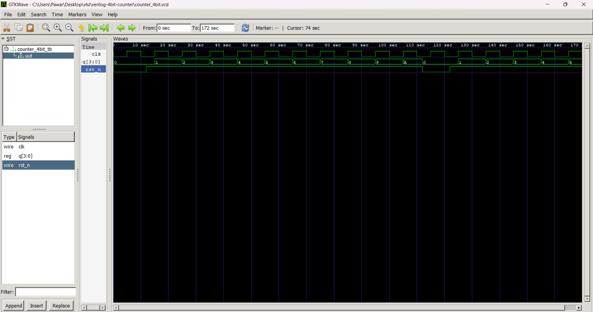

# 4-bit Synchronous Counter (Verilog)

## 📌 Description
A simple 4-bit synchronous up-counter with active-low asynchronous reset, written in Verilog.

## ⚙️ Files
- `counter_4bit.v` — RTL module
- `counter_4bit_tb.v` — Testbench
- `counter_4bit.vcd` — Simulation waveform file
- `waveform.png` — Screenshot of GTKWave output (add it!)

## 🚦 How to Run
**Compile:**
```bash
iverilog -o counter_4bit_tb.vvp counter_4bit.v counter_4bit_tb.v
## 🔍 Example Waveform

Below is the GTKWave output of the 4-bit counter:


